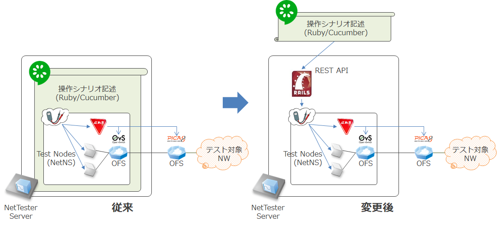
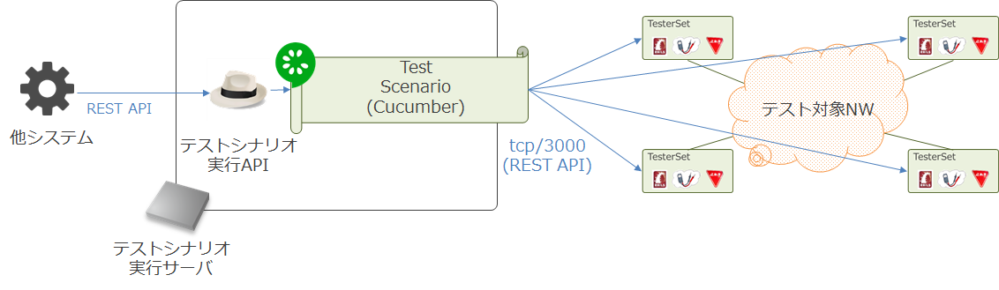
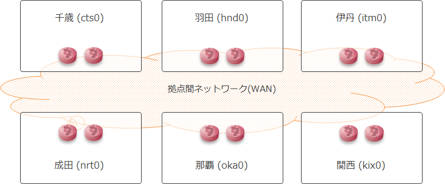

# NetTester Multisite Examples

[物理ネットワークのための受け入れテストツール: NetTester](https://github.com/net-tester/net-tester)を複数の拠点に展開して、
た拠点間の通信試験を実施するテストシナリオです。

## NetTester による拠点間テストの自動化

NetTester プロジェクトでは、ネットワークのテスト作業から人手に依存する箇所を取り除いて、ネットワークの構築(開発)～テストのプロセスを効率よく実行できるようにすることを狙っています。

これまで、[拠点内にある単一のネットワークに対する通信テスト・障害(リンクダウン)テストのテストシナリオ](https://github.com/net-tester/examples)について検証していました。しかし、実際のネットワークでは、NetTesterひとつでテストしたい範囲すべてをカバーできるわけではありません。特に、複数拠点を接続するネットワークの試験においては、各拠点に複数のテストシステムを設置した上で、それらを連動できるようににする必要がありました。

そこで、これまでテストシナリオとほとんど一体になっていた NetTester システムの構成を見直して、テストシステム (NetTester) とテストシナリオが疎結合になるようにしました。


また、テストシナリオを上位のシステムと連携して実行制御できるように、[テストシナリオに対する API](https://github.com/net-tester/scenario-api) を提供しました。


## 複数拠点間通信テスト

### テスト対象のネットワーク

下の図のように、6 拠点が WAN で接続されている環境で、拠点間 (WAN Edge 間) での L3 通信試験を実施します。


なお、上の図にある拠点名は空港名 ([空港コード \- Wikipedia](https://ja.wikipedia.org/wiki/%E7%A9%BA%E6%B8%AF%E3%82%B3%E3%83%BC%E3%83%89) 参照) をもとにした架空の構成です。実際に [NTT Communications](http://www.ntt.com/) 様の社内環境をお借りして、都内 6 拠点で接続される拠点間ネットワークへ実際に導入して検証しています。

### テストシナリオ

拠点間のテストシナリオとしては様々なパターンが考えられますが、今回は以下のような方針でテストシナリオを実装しました。
* シンプルな2拠点間のテストシナリオをベースにする
* 各拠点にある WAN Edge Router 直下にテストノードを置き、WAN Edge 間での L3 通信試験を行う
    * WAN 部分での問題切り分けを中心に考える
* WAN Edge Router は拠点ごとに冗長構成で設置される。冗長系のパスについてもテストを行う。
    * テストパターンが増大するため、手作業だとなかなかチェックしきれないところをフォローする

テストシナリオは下記のように 2 拠点間テストシナリオの集合になっています。(6 拠点から 2 点取る組み合わせなので 6c2 = 15 シナリオ)
* [千歳-伊丹 間](./features/admin/cts0_to_itm0/ping.feature)
* [千歳-関西 間](./features/admin/cts0_to_kix0/ping.feature)
* [千歳-那覇 間](./features/admin/cts0_to_oka0/ping.feature)
* [羽田-千歳 間](./features/admin/hnd0_to_cts0/ping.feature)
* [羽田-伊丹 間](./features/admin/hnd0_to_itm0/ping.feature)
* [羽田-関西 間](./features/admin/hnd0_to_kix0/ping.feature)
* [羽田-成田 間](./features/admin/hnd0_to_nrt0/ping.feature)
* [羽田-那覇 間](./features/admin/hnd0_to_oka0/ping.feature)
* [伊丹-関西 間](./features/admin/itm0_to_kix0/ping.feature)
* [成田-千歳 間](./features/admin/nrt0_to_cts0/ping.feature)
* [成田-伊丹 間](./features/admin/nrt0_to_itm0/ping.feature)
* [成田-関西 間](./features/admin/nrt0_to_kix0/ping.feature)
* [成田-那覇 間](./features/admin/nrt0_to_oka0/ping.feature)
* [那覇-伊丹 間](./features/admin/oka0_to_itm0/ping.feature)
* [那覇-関西 間](./features/admin/oka0_to_kix0/ping.feature)

### テストの実行

2 拠点間テストシナリオには拠点名ごとのタグが設定されています。拠点間通信テストを実行した場合は、Cucumber に対して複数の拠点名タグを指定することで実行します。例えば、羽田-那覇間のテストは [pingtest](pingtest) コマンドで以下のように実行します。引数に渡すタグ (`@拠点名`) を複数指定することで、各拠点間の通信を網羅的にテストします。

```
$ pingtest 2002 @hnd0 @oka0
@multi-site @hnd0 @oka0
Feature: VLAN 開通確認 (hnd0-oka0)
  Backbone チーム担当者として、
  拠点 Provider Edge 間で通信できるかどうか確認したい
  なぜなら、 VLAN 開通設定を間違えることがあるから

  Scenario: VLAN 開設後の ping
    Given 環境変数 VLAN_ID のユーザグループ
      | 拠点   | ノード   |
      | hnd0 | hnd01 |
      | hnd0 | hnd02 |
      | oka0 | oka01 |
      | oka0 | oka02 |
    And 通信要件表
      | 送信元   | 送信先   | 通信可否 |
      | hnd01 | hnd02 | O    |
      | hnd01 | oka01 | O    |
      | hnd01 | oka02 | O    |
      | hnd02 | hnd01 | O    |
      | hnd02 | oka01 | O    |
      | hnd02 | oka02 | O    |
      | oka01 | hnd01 | O    |
      | oka01 | hnd02 | O    |
      | oka01 | oka02 | O    |
      | oka02 | hnd01 | O    |
      | oka02 | hnd02 | O    |
      | oka02 | oka01 | O    |
    When 通信要件どおりに ping
    Then 通信要件どおりに ping 成功

1 scenario (1 passed)
4 steps (4 passed)
0m25.656s
```

## 実際のテストの様子

実際にどのようなテストを実施しているのかを以下の動画で見ることができます。この動画では、テストシナリオの上位システムとの連携、実際のテスト実行の様子などを解説しています。

[](https://youtu.be/DhKutgqYdSw)

## 参考資料

拠点間通信テストの自動化について、詳細は下記の資料をご覧ください。
* [ネットワークテスト自動化システムの実適用](https://www.okinawaopenlabs.com/ood/2017/wp-content/uploads/sites/4/2017/10/OOD2017_NWTestSys_%E7%99%BA%E8%A1%A8%E8%B3%87%E6%96%99.pdf) (pdf), [Okinawa Open Days 2017](https://www.okinawaopenlabs.com/ood/2017/), 2017/12/07
